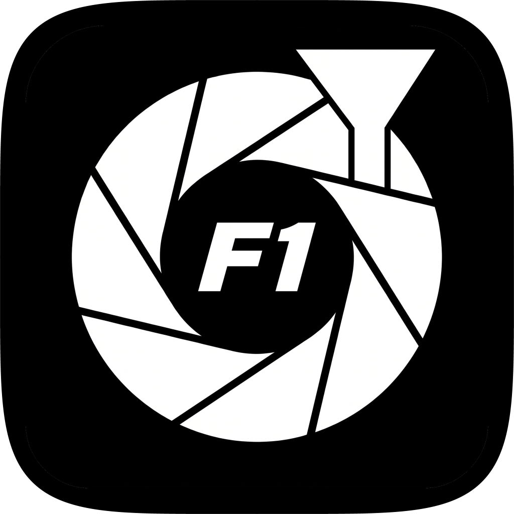

<p align="center">
  
</p>

# Auto Culling

**中文版** | [English](README.md)

面向 F1 及各类赛车摄影的自动筛选工具。指向相机直出的文件夹即可：自动完成连拍分组、
逐帧多阶段 AI 评分、每组精选，并直接写入 Lightroom 兼容的星级/拒绝标记与自动裁剪
参数——无需人工初筛。


- **输入**：相机直出文件夹——索尼 ARW、尼康 NEF、佳能 CR2/CR3、富士 RAF、奥之心 ORF、
  松下 RW2、HEIF（`.hif/.heif/.heic`）、JPEG、PNG、TIFF
- **输出**：`.xmp` 附属文件（RAW/HEIF）或文件内 XMP（JPEG），含星级、拒绝标记与裁剪参数
- **运行时**：纯 ONNX Runtime，无需 PyTorch。GPU 加速自动启用（Apple Silicon 走 CoreML、
  Windows 走 DirectML/CUDA），无 GPU 自动回退 CPU。

## 快速开始

### 桌面 GUI（推荐）

从 [GitHub Releases](https://github.com/Au3C2/AutoCullingF1/releases) 下载安装包：

| 平台 | 安装包 | 安装方式 |
| :--- | :--- | :--- |
| Windows | `AutoCulling_v*_win_x64_setup.exe` | 双击安装——按用户安装到 `%LOCALAPPDATA%\AutoCulling`，无需管理员权限 |
| Windows | `AutoCulling_v*_win_x64_portable.zip` | 免安装——解压到任意位置，运行 `auto_culling.exe` |
| macOS（Apple Silicon） | `AutoCulling_v*_macos_arm64.dmg` | 打开 DMG，将 `AutoCulling.app` 拖入 Applications |

每个安装包都附带 `.sha256` 校验文件——用 `Get-FileHash -Algorithm SHA256`（Windows）
或 `shasum -a 256`（macOS）验证。

启动 `auto_culling.exe`（Windows）或 `AutoCulling.app`（macOS），选择相机直出的
文件夹并运行——星级、拒绝标记与裁剪参数随扫描进度实时写入。应用内置完整 AI 引擎，
安装目录为**平铺自包含结构**：`auto_culling.exe`（GUI）、`auto_culling_cli.exe`
（命令行）、`auto_culling_engine.exe`（内部引擎）与 `lib/`（模型、exiftool、运行时）
并列存放——请勿单独移动或删除其中任何一项。

首次启动提示：Windows SmartScreen 可能对未签名安装包弹出确认；macOS 应用为 ad-hoc
签名，首次启动可能需要右键 → 打开。

### 内置命令行

每个安装包同时附带控制台 CLI，与 GUI 共用同一引擎——适合脚本化与服务器批量处理：

```powershell
# Windows —— 默认安装目录（便携版为解压目录）
& "$env:LOCALAPPDATA\AutoCulling\auto_culling_cli.exe" --input-dir C:\Photos\F1 --recursive --force
```

```bash
# macOS
/Applications/AutoCulling.app/Contents/Resources/auto_culling_cli \
  --input-dir /path/to/photos --recursive --force
```

参数与 Python 版 CLI 完全一致（见下表）。省略 `--input-dir` 会弹出文件夹选择器。
已评分的文件自动跳过（`--force` 强制重跑）。

### 方式二：从源码运行

前置条件：Python 3.10+ 与 [uv](https://github.com/astral-sh/uv)，ffmpeg 在 PATH 中
（macOS：`brew install ffmpeg`；Windows：`external/ffmpeg/` 已内置）。

```bash
uv sync
source .venv/bin/activate        # Windows: .venv\Scripts\activate
python cull_photos.py --input-dir /path/to/photos --recursive --force
```

省略 `--input-dir` 会打开小型 GUI（customtkinter）。

### 从源码打包桌面安装包

前置条件：Python 3.10+ 与 uv、[Rust 工具链](https://rustup.rs)、Node.js 18+
（Tauri CLI 通过 `npx` 运行）。exiftool 与 ffmpeg 在 Windows 下已内置；macOS 下
执行一次 `brew install exiftool ffmpeg`。

```bash
uv sync
source .venv/bin/activate        # Windows: .venv\Scripts\activate
python packaging/build_gui.py    # 调试 GUI 时可加 --skip-engine 跳过 PyInstaller 步骤
```

脚本会先编译 Python 引擎（PyInstaller onedir），再构建 Tauri 壳，产物输出到
`dist/`：

- **Windows**：`AutoCulling_v*_win_x64_setup.exe`（NSIS）+ `AutoCulling_v*_win_x64_portable.zip`
- **macOS**：`AutoCulling_v*_macos_arm64.dmg` + `AutoCulling.app`

每个产物自动生成 `.sha256`。CI（`.github/workflows/guards-gui.yml`）在每次 push
时构建相同的安装包并对其运行安装/启动测试。

### 常用参数

| 参数 | 说明 |
| :--- | :--- |
| `--workers N` | 解码进程池大小（默认 8；星级与 worker 数无关） |
| `--top-n 11` | 每组连拍最多保留张数 |
| `--scale-width 1280` | 评分链解码分辨率 |
| `--p4-policy` | `always`（默认）/ `never` / `auto`（仅 F1/GP 目录） |
| `--crop-off` | 关闭自动裁剪写入 |
| `--dry-run` | 只评分与报告，不写任何元数据 |
| `--dump-scores FILE` | 导出逐图 CSV（锐度/构图/原始分/星级） |
| `--force` | 强制重分析已评分文件 |
| `--deterministic` | 跨平台位一致的 CPU 路径（较慢） |

## 工作原理

1. **连拍分组**：按 EXIF 拍摄时间分组，EXIF 不可用时回退到时间间隔策略。
2. **逐帧评分**：
   - **锐度**：基于 FFT 的高频能量比，叠加主体 ROI 加权；失焦帧直接否决。
   - **构图**：F1 专用 YOLO 模型（未命中时级联 COCO `yolov8n` 兜底）评估主体面积、
     位置与留白。
   - **朝向与完整性**：轻量分类器否决正后方视角，惩罚切割/遮挡主体。
3. **Top-N 筛选**：每组连拍保留最优 *N* 张（默认 11），组内其余降级。
4. **自动裁剪**：围绕检测主体生成 Lightroom 裁剪框（3:2 / 2:3），与星级一并写入。

一票否决（rating = −1）：未检测到主体、失焦、车辆正后方视角、分数低于保留下限。
具体权重与阈值在 `cull/scorer.py` 中，并锁定于 `tests/baselines/` 下的确定性真值。

## 性能

门协议（每格式约 500 张真实相机文件，稳态吞吐）：

**macOS — Apple M4，workers = 4**

| JPEG | HEIF | 索尼 ARW | 尼康 NEF |
| ---: | ---: | ---: | ---: |
| 83.5 img/s | 65.5 img/s | 49.9 img/s | 70.0 img/s |

**Windows** — Ryzen 7 5700X + RTX 4070 Ti，默认 workers = 8：各格式 35–46 img/s。

测试方法论、各平台基线与优化史见
[`results/performance_baseline.md`](results/performance_baseline.md)。

## 开发者

```text
cull/           核心引擎：解码、连拍分组、检测、评分、XMP 写入、GUI
models/         ONNX 权重
train/          训练流水线（YOLO 微调、P4 多任务、围栏分类器）
packaging/      PyInstaller 构建 + 统一回归套件（guards.py）
benchmarks/     分格式稳态性能门
tests/          精度门禁、确定性真值、CI harness
scripts/ eval/ docs/ results/    工具脚本、标注指南、基线记录
external/       内置 exiftool（Windows 另含 ffmpeg）
```

回归门禁：

```bash
pytest tests/ -m deterministic                        # 跨平台真值（严格）
pytest tests/test_cull.py tests/test_precision_heif.py tests/test_precision_raw.py
python packaging/guards.py    # 精度 → 性能 → 构建 → 打包门，约 15 分钟
```

CI（`.github/workflows/`）在 GitHub 托管的 macOS/Windows runner 上用已提交的种子样本
跑同一套门禁。构建目标：

```bash
uv pip install pyinstaller
python packaging/build.py            # 独立 CLI onedir（精度守卫使用）
python packaging/build_gui.py        # 桌面 GUI 安装包：setup / portable / DMG
```

延伸阅读：[`results/performance_baseline.md`](results/performance_baseline.md)
（实测数据与平台基线）、[`docs/P4_LABELING.md`](docs/P4_LABELING.md)（P4 标注指南）。

## 许可证

[Apache License 2.0](LICENSE)
